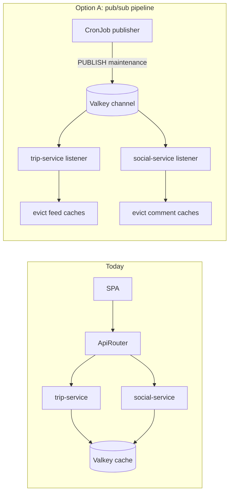
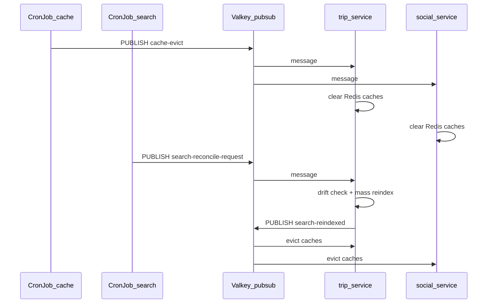

# Kubernetes CronJob ideas (pub/sub + maintenance)

## Context

Today the stack is **synchronous HTTP only** — [report_6.md](progress-reports/6/report_6.md) explicitly notes *"No Pub/Sub or queues between services"*. The only batch workload is the optional one-shot **seed Job** ([`job-seed.yaml`](infrastructure/ms2/charts/tripplanning/templates/job-seed.yaml)), applied manually via [`gke-seed-job.sh`](backend/scripts/gke-seed-job.sh). Valkey is already deployed and used for **cache + distributed locks** ([`SearchIndexCoordinationService`](backend/tripplanning-trip-service/src/main/java/com/tripplanning/search/SearchIndexCoordinationService.java)), not pub/sub.

A CronJob is the right primitive to introduce **scheduled, disposable background work** (12-factor *disposability*) without `@Scheduled` running on every HPA replica.



---

## Option A — Valkey pub/sub cache-invalidation pipeline (teaching)

**Concept conveyed:** producer/consumer decoupling, event-driven maintenance, why CronJob + message bus beats HTTP fan-out or per-replica `@Scheduled`.

**Real use case:** trip-service and social-service cache feed/comment pages in Valkey ([`TripFeedCachedReader`](backend/tripplanning-trip-service/src/main/java/com/tripplanning/trip/read/TripFeedCachedReader.java), [`CommunityCachedReader`](backend/tripplanning-social-service/src/main/java/com/tripplanning/social/CommunityCachedReader.java)). A scheduled **cache sweep** keeps stale pages bounded without restarting pods or calling each replica over HTTP.

### Flow

1. **CronJob** (e.g. every 6h: `0 */6 * * *`) runs a tiny container with `redis-cli`.
2. `PUBLISH tripplanning:events:maintenance '{"event":"cache-evict","scope":"all"}'`
3. **trip-service** and **social-service** each register a `RedisMessageListenerContainer` subscriber (new ~40-line class per service).
4. On message → `cacheManager.getCacheNames().forEach(c -> cacheManager.getCache(c).clear())` (or scoped evict by `scope`).
5. Pod logs: `Received maintenance event cache-evict; evicted N caches` — visible in Loki/kubectl.

### Example Helm addition

New template beside seed job: [`infrastructure/ms2/charts/tripplanning/templates/cronjob-cache-maintenance.yaml`](infrastructure/ms2/charts/tripplanning/templates/cronjob-cache-maintenance.yaml)

```yaml
# values.yaml (disabled by default, like seedJob)
maintenanceCronJob:
  enabled: false
  schedule: "0 */6 * * *"
  concurrencyPolicy: Forbid
  channel: tripplanning:events:maintenance
  image: redis:7-alpine   # redis-cli only; no new GHCR image
```

Container command (no new Maven module):

```bash
redis-cli -h valkey -p 6379 PUBLISH tripplanning:events:maintenance \
  '{"event":"cache-evict","scope":"all","source":"cronjob"}'
```

Mirror in [`backend/k8s/local/chart/`](backend/k8s/local/chart/) for minikube; enable in GitOps via [`values-configmap.yaml`](infrastructure/ms2/gitops/tenants/free/shared/values-configmap.yaml) when ready.

### Backend touch (small)

| File | Change |
|------|--------|
| `trip-service` new `MaintenanceEventListener.java` | Subscribe to channel; evict Redis caches on `cache-evict` |
| `social-service` same pattern | Evict social read caches |
| `application.yml` | `tripplanning.maintenance.channel` + `enabled` flag |

**Effort:** ~1 Helm template + ~80 lines Java + values. **No new Docker image.**

### Tiered multitenancy hook (future)

For Standard tier, CronJob stays **one per shared namespace**; messages include `tenant` slug and listeners evict only keys prefixed `std:{slug}:` (already planned in [tiered_multitenancy_plan.md](infrastructure/ms2/docs/tiered_multitenancy_plan.md)).

---

## Option B — Search index drift reconciler (operational)

**Concept conveyed:** batch reconciliation jobs, idempotent maintenance, coordination via existing Valkey lock — complements the startup-only [`SearchIndexCoordinationService`](backend/tripplanning-trip-service/src/main/java/com/tripplanning/search/SearchIndexCoordinationService.java).

**Real pain today:** perf seed inserts via JDBC bypass Hibernate Search; [`reset-search-index.sh`](backend/scripts/reset-search-index.sh) is run **manually** after seed. A CronJob can detect `postgres_trip_count != opensearch_doc_count` and trigger repair.

### Flow

1. CronJob (e.g. nightly `0 3 * * *`) runs a shell script (same image family as reset script: `curl` + `kubectl` is awkward inside cluster — better as a **small Spring batch module** or **in-cluster HTTP call**).
2. **Lightweight variant:** CronJob calls trip-service internal endpoint `POST /internal/maintenance/search-reconcile` (new, protected by `X-Internal-Secret`).
3. Endpoint logic (reuse existing service):
   - Read `tripRepository.count()` vs OpenSearch doc count (already in `SearchIndexCoordinationService.currentStatus()`).
   - If drift → acquire Valkey lock → mass reindex (existing `ensureIndexPopulated()` path).
   - If counts match but content stale (seed scenario) → optional `force=true` query param deletes indices first (logic from `reset-search-index.sh`).
4. **Optional pub/sub finish:** after reconcile, `PUBLISH` `{"event":"search-reindexed"}` so caches evict (bridges to Option A).

### Example schedule + probe

```yaml
searchReconcileCronJob:
  enabled: false
  schedule: "0 3 * * *"
  tripServiceUrl: http://trip-service:8080
  forceReindex: false   # true only after known bulk JDBC loads
```

CronJob container: `curl -sf -X POST -H "X-Internal-Secret: $SECRET" \
  "$TRIP_SERVICE_URL/internal/maintenance/search-reconcile"`

**Effort:** ~1 Helm template + ~1 internal controller method + reuse existing search code. Aligns with [performance-api-followup.md](docs/performance-api-followup.md) item E1 (*"dedicated job"* for mass indexer).

**Trade-off:** less "pipeline" teaching unless you add the post-reconcile pub/sub notify.

---

## Option C — Minimal combined path (recommended rollout)

Do **Option A first** (smallest diff, clearest pub/sub story), then add **Option B's drift check** as a second CronJob or a second message type on the same channel.

### Unified event channel

Single Valkey channel `tripplanning:events:maintenance` with typed JSON:

| `event` | Publisher | Subscribers |
|---------|-----------|-------------|
| `cache-evict` | cache CronJob (scheduled) | trip-service, social-service |
| `search-reconcile-request` | search CronJob (nightly) | trip-service only |
| `search-reindexed` | trip-service after reindex | trip-service, social-service → evict caches |



**Why not GCP Pub/Sub:** adds IAM, topics, subscriptions, and cost — fine for Enterprise tier later, overkill for a course demo. Valkey pub/sub teaches the same *decouple producer from consumer* idea using infra you already run.

**Why not `@Scheduled` in Deployments:** with HPA (2–4 trip-service replicas), every pod would run the job unless you add Redis locking — CronJob is the K8s-native pattern ([ms2_report.md](infrastructure/ms2/docs/ms2_report.md) §2.1: *"Async/background services: none"*).

---

## What to document for the course/report

Add a short subsection to [ms2_report.md](infrastructure/ms2/docs/ms2_report.md) or progress report runtime view:

- **Before:** sync HTTP microservices only
- **After:** first background workload = Kubernetes CronJob; first async pattern = Valkey pub/sub maintenance channel
- Diagram (above) + `kubectl get cronjobs` / sample log line
- Contrast with GitHub Actions cron ([`sync-gke-secrets.yml`](backend/.github/workflows/sync-gke-secrets.yml)) — CI cron for *infra*, K8s CronJob for *in-cluster app maintenance*

---

## Suggested implementation order

1. **Helm CronJob template** (Option A) — `enabled: false` default, mirror local chart
2. **trip-service + social-service listeners** — feature-flagged `tripplanning.maintenance.listener.enabled`
3. **Enable on minikube** first via local chart values; verify with `redis-cli SUBSCRIBE` in debug pod
4. **Option B internal endpoint** + second CronJob (or extend publisher script with drift HTTP call)
5. **GitOps enable** for free tier when stable
6. **Docs** — one paragraph + mermaid in ms2 report

## Files to touch (summary)

| Area | Files |
|------|-------|
| Helm (GKE) | [`templates/cronjob-cache-maintenance.yaml`](infrastructure/ms2/charts/tripplanning/templates/) (new), [`values.yaml`](infrastructure/ms2/charts/tripplanning/values.yaml), optional `cronjob-search-reconcile.yaml` |
| Helm (local) | [`backend/k8s/local/chart/templates/`](backend/k8s/local/chart/templates/) mirror |
| GitOps | [`gitops/tenants/free/shared/values-configmap.yaml`](infrastructure/ms2/gitops/tenants/free/shared/values-configmap.yaml) |
| Backend | `MaintenanceEventListener` in trip + social; optional `InternalMaintenanceController` in trip |
| Docs | [`ms2_report.md`](infrastructure/ms2/docs/ms2_report.md) §2.1 async services |

**Explicitly out of scope:** new Maven module, GCP Pub/Sub, new StatefulSet, observability stack changes.
