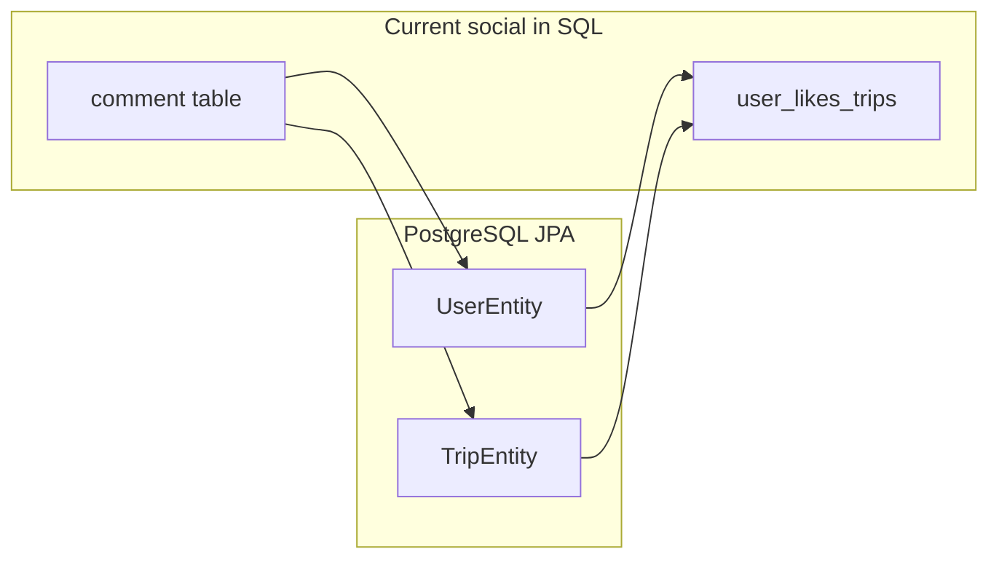
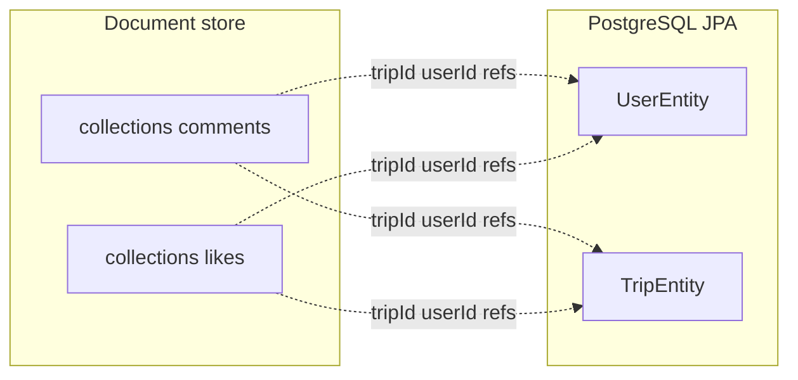

# Document store for comments and likes (fresh start)

## Goals and runtime strategy

- **Scalability**: Move likes and comments off PostgreSQL so community data can grow (many comments or likes on a single “viral” trip) without huge join tables, lock contention, or unbounded SQL rows on core trip/user tables. Prefer **paginated** reads and **O(1)-style** membership checks (e.g. like exists) at the document layer; design indexes for “by trip”, “by user”, and counts.
- **Development**: **Local MongoDB** — familiar tooling, same **Spring Data MongoDB** model as today’s Java ecosystem, easy Docker/`mongod` setup.
- **Production**: **Google Firestore** — managed, elastic scale in GCP alongside Cloud Run; document model is **Mongo-like** (collections, documents, indexes) but **not** the MongoDB wire protocol. Implementation will use a **Firestore-specific client** (e.g. Firebase Admin / `spring-cloud-gcp-starter-data-firestore` or equivalent) **or** a thin abstraction over “social storage” with two implementations (Mongo vs Firestore). Do not assume a single `MongoRepository` runs unchanged in prod unless you standardize on MongoDB Atlas on GCP instead of Firestore.

## Current state

- **Comments**: JPA [`CommentEntity`](../../src/main/java/com/tripplanning/comment/CommentEntity.java) maps to table `comment` with FKs to `users` and `trips`. [`CommentRepository`](../../src/main/java/com/tripplanning/comment/CommentRepository.java) is a `JpaRepository` exported at `/api/v2/comments` with `findByTripIdOrderByCreatedAtDesc` and `deleteByUserId`.
- **Likes**: Not a separate entity — `@ManyToMany` on [`UserEntity.likedTrips`](../../src/main/java/com/tripplanning/user/UserEntity.java) / [`TripEntity.likedByUsers`](../../src/main/java/com/tripplanning/trip/TripEntity.java) backed by `user_likes_trips`. [`TripRepository`](../../src/main/java/com/tripplanning/trip/TripRepository.java) exposes `countLikes` and `findByLikedByUsersId`.
- **Frontend contracts** (sibling repo / monorepo `frontend/`): [`comments.ts`](../../../frontend/src/api/comments.ts) uses HAL list + POST with `trip` / `user` URI refs; [`likes.ts`](../../../frontend/src/api/likes.ts) uses Spring Data REST **association** routes on users (`/users/{id}/likedTrips`, `POST` with `text/uri-list`, `DELETE` by id); [`trips.ts`](../../../frontend/src/api/trips.ts) calls `/trips/search/countLikes` and `findByLikedByUsersId`.

You chose **no historical migration** — Flyway can drop social tables once the app reads/writes the document store only.

## Target architecture

- Add **`spring-boot-starter-data-mongodb`** to [`pom.xml`](../../pom.xml) for **local/dev** (and optional CI) against MongoDB.
- Introduce Mongo **documents** (suggested package e.g. `com.tripplanning.social` or under `comment` / `like` subpackages — keep **Mongo repositories in a dedicated package** so [`@EnableMongoRepositories`](https://docs.spring.io/spring-data/mongodb/docs/current/reference/html/) can target them alongside existing JPA repos).
- **Comments document**: `_id` (String `ObjectId`), `tripId` (Long), `userId` (Long), `content`, `createdAt` (store as `Instant` or `LocalDateTime` consistently). Index on `tripId` + `createdAt` for the list query.
- **Likes document**: natural pair `(userId, tripId)` with **`@CompoundIndex`** (unique) so a like is idempotent and lookups are fast. No need to mirror the old join-table shape beyond that.

Dev: MongoDB. Prod: Firestore (same logical collections and fields; different drivers/config).

## Repository layer

| Concern | Approach |
|--------|----------|
| **Comment storage** | **Mongo (dev):** `MongoRepository<CommentDocument, String>` with `Page<CommentDocument> findByTripIdOrderByCreatedAtDesc(Long tripId, Pageable pageable)` and `void deleteByUserId(Long userId)`. **Firestore (prod):** same operations via Firestore queries + composite indexes (e.g. `tripId` + `createdAt` desc). |
| **Like storage** | **Mongo:** `countByTripId`, `existsByUserIdAndTripId`, `deleteByUserIdAndTripId`, paginated “trips liked by user”. **Firestore:** same; define indexes for membership and counts; avoid unbounded collection scans on viral trips. |
| **JPA `TripRepository`** | Remove `countLikes` and `findByLikedByUsersId` — implement via document store (Mongo or Firestore) from application services / controllers, not JPA. |
| **JPA `UserEntity` / `TripEntity`** | Remove `likedTrips` / `likedByUsers` and the `@JoinTable` so Hibernate no longer manages `user_likes_trips`. |

## REST / API compatibility (important)

Spring Data REST today relies on **JPA associations** for:

1. **Comments `POST`** with `trip` and `user` as HAL/URI-style links ([`createComment`](../../../frontend/src/api/comments.ts)).
2. **User likes** as **association sub-resources** (`/users/{id}/likedTrips/...`) with `POST` body `text/uri-list` ([`likeTrip`](../../../frontend/src/api/likes.ts)).

Document rows with only `tripId`/`userId` **do not** deserialize those association payloads the same way JPA `@ManyToOne` does. To avoid breaking the frontend, plan one of these (recommend **A** for clarity):

- **A (recommended)**: Keep Spring Data Mongo repositories **not exported** in dev (`@RepositoryRestResource(exported = false)` or no annotation); in prod use **services** backed by Firestore. Add **small `@RestController` / `@BasePathAwareController` handlers** under the same paths the client uses:
  - Comments: collection GET (paginated search), POST (parse `trip`/`user` URIs or plain `/trips/{id}` segments into Long ids), item GET/DELETE if currently used; return HAL-shaped JSON consistent with today (or adjust `frontend` minimally if you standardize on a simpler JSON DTO).
  - Likes: implement `GET` list, `GET`/`HEAD` exists, `POST` (`text/uri-list`), `DELETE` for `/users/{userId}/likedTrips[/{tripId}]` backed by like storage (Mongo or Firestore) + load `TripEntity` from JPA when the response must embed trip resources.
  - Trips: `GET .../trips/search/countLikes?tripId=` and `findByLikedByUsersId?userId=` implemented in a controller that delegates to the document store for counts/ids and JPA to resolve trips into the same page shape as today.

- **B**: Try `@RepositoryRestResource` on Mongo repos **only** in dev if you add integration tests proving HAL POST and user association routes still work; expect gaps and fall back to A. Firestore prod still goes through A-style controllers.

## Schema / Flyway

- Add **`V3__drop_social_tables.sql`** (name as you prefer): `DROP TABLE` / `DROP CONSTRAINT` order safe for `comment` and `user_likes_trips` (after entities no longer reference them). Remove indexes from [`V2__user_likes_trips_indexes.sql`](../../src/main/resources/db/migration/V2__user_likes_trips_indexes.sql) implicitly by dropping the table.
- Align [`application-local.yml`](../../src/main/resources/application-local.yml) with **`spring.data.mongodb.uri`** pointing at **local MongoDB** (e.g. `mongodb://localhost:27017/tripplanning`). Use [`application.yml`](../../src/main/resources/application.yml) / **`application-prod.yml`** (or profile) for **Firestore**: GCP project ID, credentials (Workload Identity / service account JSON secret), and Firestore database ID — not a Mongo URI.
- **Profiles:** e.g. `dev`/`local` → Mongo only; `prod` (Cloud Run) → Firestore only, so the app never opens a Mongo connection in production if that is the policy.

## Deployment

- Extend [`.github/workflows/deploy-gcp-cloudrun.yml`](../../.github/workflows/deploy-gcp-cloudrun.yml) (or GitHub Environment variables) for **production document store**:
  - **Firestore**: grant the Cloud Run service account **Datastore User** (or appropriate Firestore roles), set `GOOGLE_CLOUD_PROJECT` / Firestore config env vars, and use Application Default Credentials — no Mongo URI in prod if using Firestore end-to-end.
  - **Local Mongo** stays developer machines / optional CI job with a Mongo container; do not require Firestore for every `mvn test` unless you add integration tests with the emulator.
- Ensure VPC / IAM allow Cloud Run → Firestore in the same GCP project (typical default); cross-project Firestore is possible but out of scope unless needed.

## Tests and scripts

- No backend tests currently reference comments/likes; add **slice or `@SpringBootTest`** smoke tests for the new controllers or repositories if you want regression safety.
- [`performance/seeding_example/seed_example_data.py`](../../../performance/seeding_example/seed_example_data.py) (monorepo) should keep working **if** REST paths and payloads stay compatible; re-run once after implementation.

## Out of scope / follow-ups

- **Cross-store transactions** (PostgreSQL + document store) are not atomic; acceptable for likes/comments; document if you add user-delete flows that must purge comments/likes in Mongo/Firestore (`deleteByUserId` exists but is **not wired** in Java today).
- **Firestore vs Mongo API**: Spring Data MongoDB does not speak to Firestore; production code paths must be implemented explicitly or via Spring Cloud GCP Firestore — keep domain models aligned so both backends stay in sync.
- **Performance/locust** (sibling repo / monorepo `performance/`): [`locustfile.py`](../../../performance/locustfile.py) may assume SQL-backed latency — revisit after deployment.
