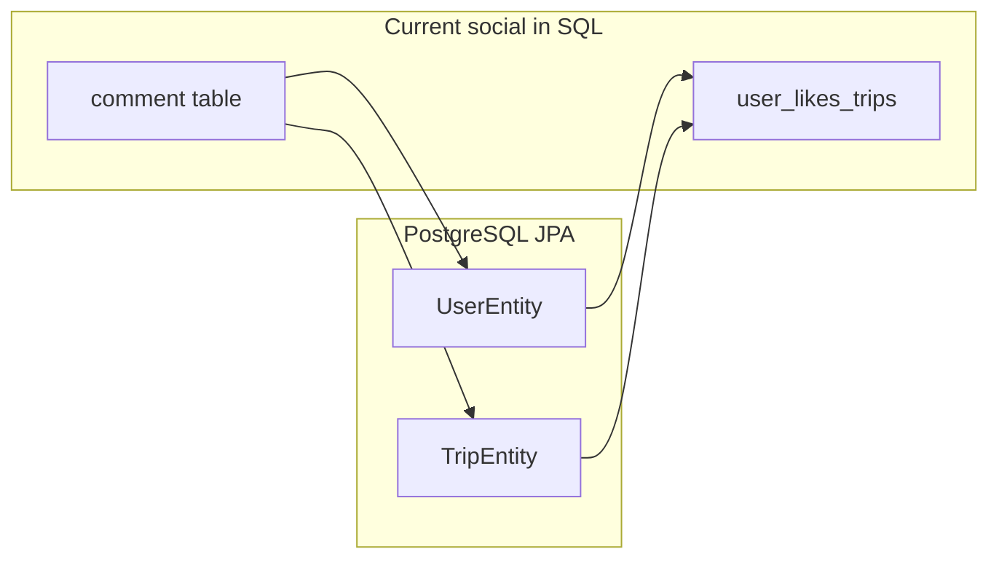
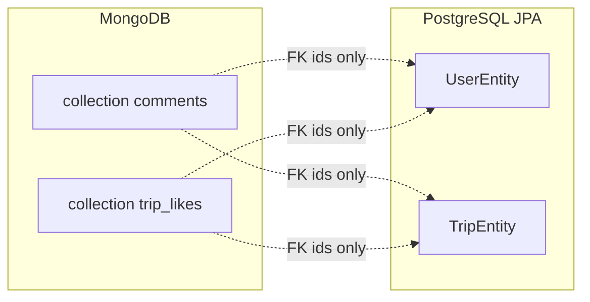

# MongoDB for comments and likes (fresh start)

## Current state

- **Comments**: JPA [`CommentEntity`](../../src/main/java/com/tripplanning/comment/CommentEntity.java) maps to table `comment` with FKs to `users` and `trips`. [`CommentRepository`](../../src/main/java/com/tripplanning/comment/CommentRepository.java) is a `JpaRepository` exported at `/api/v2/comments` with `findByTripIdOrderByCreatedAtDesc` and `deleteByUserId`.
- **Likes**: Not a separate entity — `@ManyToMany` on [`UserEntity.likedTrips`](../../src/main/java/com/tripplanning/user/UserEntity.java) / [`TripEntity.likedByUsers`](../../src/main/java/com/tripplanning/trip/TripEntity.java) backed by `user_likes_trips`. [`TripRepository`](../../src/main/java/com/tripplanning/trip/TripRepository.java) exposes `countLikes` and `findByLikedByUsersId`.
- **Frontend contracts** (sibling repo / monorepo `frontend/`): [`comments.ts`](../../../frontend/src/api/comments.ts) uses HAL list + POST with `trip` / `user` URI refs; [`likes.ts`](../../../frontend/src/api/likes.ts) uses Spring Data REST **association** routes on users (`/users/{id}/likedTrips`, `POST` with `text/uri-list`, `DELETE` by id); [`trips.ts`](../../../frontend/src/api/trips.ts) calls `/trips/search/countLikes` and `findByLikedByUsersId`.

You chose **no historical migration** — Flyway can drop social tables once the app reads/writes Mongo only.

## Target architecture

- Add **`spring-boot-starter-data-mongodb`** to [`pom.xml`](../../pom.xml).
- Introduce Mongo **documents** (suggested package e.g. `com.tripplanning.social` or under `comment` / `like` subpackages — keep **Mongo repositories in a dedicated package** so [`@EnableMongoRepositories`](https://docs.spring.io/spring-data/mongodb/docs/current/reference/html/) can target them alongside existing JPA repos).
- **Comments document**: `_id` (String `ObjectId`), `tripId` (Long), `userId` (Long), `content`, `createdAt` (store as `Instant` or `LocalDateTime` consistently). Index on `tripId` + `createdAt` for the list query.
- **Likes document**: natural pair `(userId, tripId)` with **`@CompoundIndex`** (unique) so a like is idempotent and lookups are fast. No need to mirror the old join-table shape beyond that.

## Repository layer

| Concern | Approach |
|--------|----------|
| **Comment Mongo repository** | `MongoRepository<CommentDocument, String>` with `Page<CommentDocument> findByTripIdOrderByCreatedAtDesc(Long tripId, Pageable pageable)` and `void deleteByUserId(Long userId)`. |
| **Like Mongo repository** | `countByTripId`, `existsByUserIdAndTripId`, `deleteByUserIdAndTripId`, plus a paginated query for “trips liked by user” (return `tripId` values or page of documents sorted consistently). |
| **JPA `TripRepository`** | Remove `countLikes` and `findByLikedByUsersId` — they cannot be implemented against Mongo from a JPA interface. |
| **JPA `UserEntity` / `TripEntity`** | Remove `likedTrips` / `likedByUsers` and the `@JoinTable` so Hibernate no longer manages `user_likes_trips`. |

## REST / API compatibility (important)

Spring Data REST today relies on **JPA associations** for:

1. **Comments `POST`** with `trip` and `user` as HAL/URI-style links ([`createComment`](../../../frontend/src/api/comments.ts)).
2. **User likes** as **association sub-resources** (`/users/{id}/likedTrips/...`) with `POST` body `text/uri-list` ([`likeTrip`](../../../frontend/src/api/likes.ts)).

Mongo documents with only `tripId`/`userId` **do not** deserialize those association payloads the same way JPA `@ManyToOne` does. To avoid breaking the frontend, plan one of these (recommend **A** for clarity):

- **A (recommended)**: Keep Mongo repositories **not exported** (`@RepositoryRestResource(exported = false)` or no annotation) and add **small `@RestController` / `@BasePathAwareController` handlers** under the same paths the client uses:
  - Comments: collection GET (paginated search), POST (parse `trip`/`user` URIs or plain `/trips/{id}` segments into Long ids), item GET/DELETE if currently used; return HAL-shaped JSON consistent with today (or adjust `frontend` minimally if you standardize on a simpler JSON DTO).
  - Likes: implement `GET` list, `GET`/`HEAD` exists, `POST` (`text/uri-list`), `DELETE` for `/users/{userId}/likedTrips[/{tripId}]` backed by `TripLikeRepository` + load `TripEntity` from JPA when the response must embed trip resources.
  - Trips: `GET .../trips/search/countLikes?tripId=` and `findByLikedByUsersId?userId=` implemented in a controller that delegates to Mongo for counts/ids and JPA to resolve trips into the same page shape as today.

- **B**: Try `@RepositoryRestResource` on Mongo repos **only** if you add integration tests proving HAL POST and user association routes still work; expect gaps and fall back to A.

## Schema / Flyway

- Add **`V3__drop_social_tables.sql`** (name as you prefer): `DROP TABLE` / `DROP CONSTRAINT` order safe for `comment` and `user_likes_trips` (after entities no longer reference them). Remove indexes from [`V2__user_likes_trips_indexes.sql`](../../src/main/resources/db/migration/V2__user_likes_trips_indexes.sql) implicitly by dropping the table.
- Align [`application-local.yml`](../../src/main/resources/application-local.yml) / [`application.yml`](../../src/main/resources/application.yml) with `spring.data.mongodb.uri` (or host/port/credentials) via env, e.g. `SPRING_DATA_MONGODB_URI` for Cloud Run.

## Deployment

- Extend [`.github/workflows/deploy-gcp-cloudrun.yml`](../../.github/workflows/deploy-gcp-cloudrun.yml) (or GitHub Environment variables) to pass **`SPRING_DATA_MONGODB_URI`** (and optionally a Secret Manager reference if using Atlas with password). Ensure the Cloud Run service account can reach Mongo (Atlas IP allowlist / VPC connector if self-hosted).

## Tests and scripts

- No backend tests currently reference comments/likes; add **slice or `@SpringBootTest`** smoke tests for the new controllers or repositories if you want regression safety.
- [`performance/seeding_example/seed_example_data.py`](../../../performance/seeding_example/seed_example_data.py) (monorepo) should keep working **if** REST paths and payloads stay compatible; re-run once after implementation.

## Out of scope / follow-ups

- **Cross-store transactions** (PostgreSQL + Mongo) are not atomic; acceptable for likes/comments; document if you add user-delete flows that must purge Mongo (`deleteByUserId` exists but is **not wired** in Java today).
- **Performance/locust** (sibling repo / monorepo `performance/`): [`locustfile.py`](../../../performance/locustfile.py) may assume SQL-backed latency — revisit after deployment.
