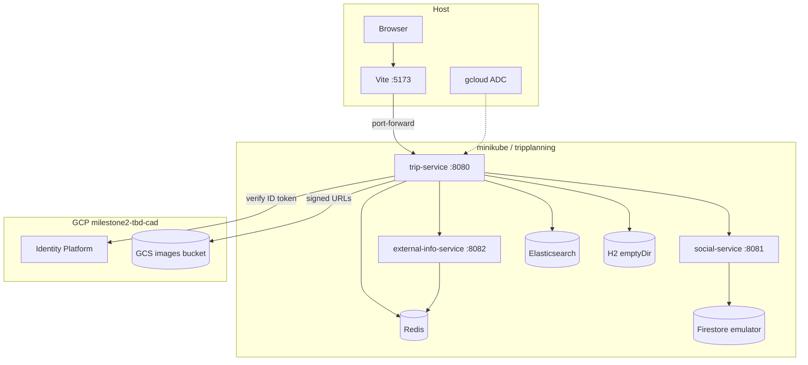
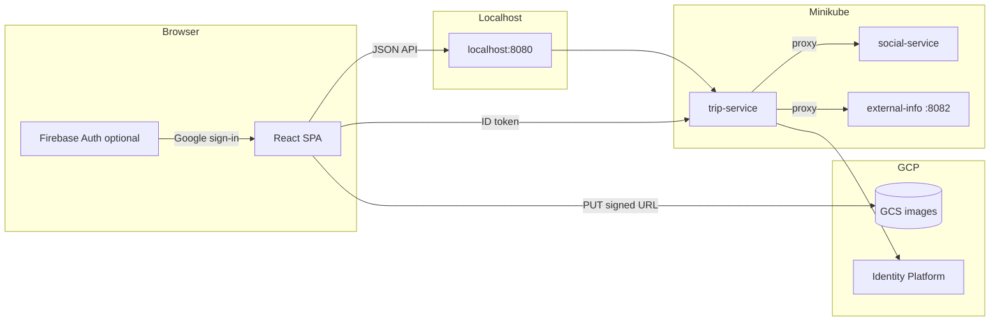
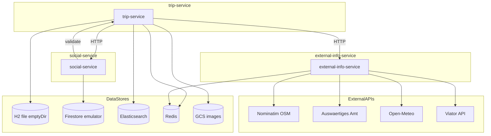
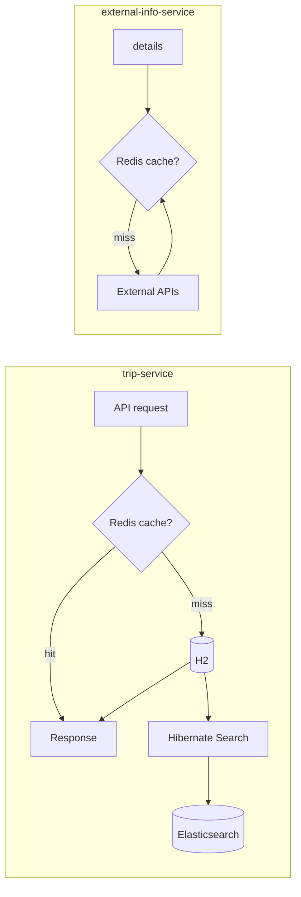

# Local Minikube state — cluster resources & data flows

Reference for the **local ms2-shaped** stack on Minikube: in-cluster components, localhost access, and the small set of GCP services still used (Identity Platform, GCS).

**Scope:** `kubectl` context `minikube`, namespace `tripplanning`. For setup/teardown, see [README.md](README.md). For GKE / Terraform inventory, see [ms2 STATE.md](../../../infrastructure/ms2/docs/gettingstarted/STATE.md).

---

## 1. Resource inventory

### Minikube cluster

| Category | Resource | Name / pattern |
|----------|----------|----------------|
| **Cluster** | Minikube | Context `minikube`; default driver `docker` |
| **Namespace** | Kubernetes | `tripplanning` |
| **Images** | Local Docker (minikube daemon) | `tripplanning-{trip,social,external-info}-service:local`, `imagePullPolicy: Never` |

### In-cluster (namespace `tripplanning`)

| Component | Implementation | Manifest |
|-----------|----------------|----------|
| **trip-service** | Spring Boot, H2 + ES + Redis | [`k8s/local/trip-service/`](../../k8s/local/trip-service/) |
| **social-service** | Spring Boot, Firestore emulator | [`k8s/local/social-service/`](../../k8s/local/social-service/) |
| **external-info-service** | Spring Boot, Redis | [`k8s/local/external-info-service/`](../../k8s/local/external-info-service/) |
| **Redis** | `redis:7-alpine` | [`infrastructure/ms2/k8s/dependencies/redis/`](../../../infrastructure/ms2/k8s/dependencies/redis/) |
| **Elasticsearch** | Elastic 8.15.x, emptyDir | [`infrastructure/ms2/k8s/dependencies/elasticsearch/`](../../../infrastructure/ms2/k8s/dependencies/elasticsearch/) |
| **Firestore emulator** | `google-cloud-cli:emulators` | [`k8s/local/firestore-emulator/`](../../k8s/local/firestore-emulator/) |

Installed by [`scripts/local-dev.sh`](../../scripts/local-dev.sh) → `install-k8s-dependencies.sh` (Redis/ES) + `kubectl apply -k k8s/local`.

### Host-only

| Component | Role |
|-----------|------|
| **Vite frontend** | `http://localhost:5173` → API via port-forward |
| **kubectl port-forward** | Maps trip `:8080`, social `:8081`, external-info `:8082` |
| **gcloud ADC** | Identity token verification, GCS signed URLs (not in-cluster) |

### GCP (used, not provisioned by local scripts)

| Service | Used by | Local behavior |
|---------|---------|----------------|
| **Identity Platform / Firebase** | trip-service (`POST /api/v2/auth/google`) | Real project; optional if using dev-login only |
| **GCS images bucket** | trip-service signed uploads | Real bucket via ADC + SA impersonation in `application-local.yml` |

### Not used locally

Terraform, GKE, Cloud SQL, Cloud Firestore `tbd-firestore`, Artifact Registry, Gateway API, Cloud DNS, cert-manager, frontend GCS bucket deploy.

---

## 2. High-level topology



---

## 3. Local hostnames & routing

| URL (after port-forward) | Serves |
|--------------------------|--------|
| `http://localhost:8080` | trip-service (primary API for SPA) |
| `http://localhost:8081` | social-service (direct access optional) |
| `http://localhost:8082` | external-info-service (normally via trip proxy) |

There is **no** GKE Gateway. The SPA should use **one** base URL (`VITE_API_BASE_URL=http://localhost:8080`). Trip-service proxies the same paths as on GKE:

| Path prefix | Handled by |
|-------------|------------|
| `/api/v2/comments`, likes | Proxied to social-service |
| `/api/v2/external/*` | Proxied to external-info-service |
| `/api/v2`, `/api/search`, `/actuator`, auth | trip-service |

---

## 4. Frontend data flow



**Behaviors:**

- Single API entry: `VITE_API_BASE_URL=http://localhost:8080`.
- **dev-login** on trip-service avoids Firebase for local testing.
- Image uploads: signed URL from trip-service; browser PUT to GCS (requires ADC on dev machine).

---

## 5. Backend microservices & data stores

| Service | Container port | K8s Service port | Role |
|---------|----------------|------------------|------|
| trip-service | 8080 | 8080 | Trips, users, locations, auth, search, proxies |
| social-service | 8081 | 8081 | Likes & comments (Firestore emulator) |
| external-info-service | 8082 | 8082 | Weather, warnings, geocoding, tours |



### Per-service data store usage

| Service | SQL | Elasticsearch | Redis | Firestore | GCS | Other HTTP |
|---------|:---:|:-------------:|:-----:|:---------:|:---:|------------|
| **trip-service** | H2 (JPA, no Flyway) | Hibernate Search `tripentity-local` | Cache 10s TTL | — | Signed uploads | social, external-info |
| **social-service** | — | — | — | Emulator `(default)` | — | trip-service |
| **external-info-service** | — | — | Cache 60m TTL | — | — | 4 external APIs |

**In-cluster DNS:**

- `elasticsearch.tripplanning.svc.cluster.local:9200`
- `redis.tripplanning.svc.cluster.local:6379`
- `firestore-emulator.tripplanning.svc.cluster.local:8080`
- `trip-service.tripplanning.svc.cluster.local:8080`
- `social-service.tripplanning.svc.cluster.local:8081`
- `external-info-service.tripplanning.svc.cluster.local:8082`

**Inter-service HTTP only** — no message broker. Optional `X-Internal-Secret` on `/internal/**`.

---

## 6. Redis & Elasticsearch



| System | Used by | Purpose |
|--------|---------|---------|
| **Elasticsearch** | trip-service (`local,k8s` profile) | Index `tripentity-local`; installed via ms2 dependencies |
| **Redis** | trip-service, external-info-service | Distributed cache; Caffeine fallback if Redis host unset (JVM-only) |

**trip-service Redis cache names** (10s TTL): `tripFeedPage`, `tripFeedByUser`, `tripFeedLikedBy`, `tripDetail`, `tripExists`.

**external-info-service Redis cache names** (60m TTL): `warnings`, `weather`, `tours`.

---

## 7. Secrets

| Kubernetes secret | Source | Keys |
|-------------------|--------|------|
| `trip-service-secrets` | `docs/gettingstarted/.env` | `TRIPPLANNING_AUTH_JWT_SECRET` |
| `social-service-secrets` | same | `TRIPPLANNING_AUTH_JWT_SECRET`, `TRIPPLANNING_INTERNAL_SECRET` |
| `external-info-service-secrets` | same | `VIATOR_API_KEY` |

No Secret Manager or External Secrets on the local path. ConfigMaps are applied imperatively by `local-dev.sh` (Firestore host, ES/Redis, CORS, service URLs).

---

## 8. Naming quick reference

```
kubectl context:  minikube
namespace:        tripplanning
image tag:        local
trip-service:     tripplanning-trip-service:local
social-service:   tripplanning-social-service:local
external-info:    tripplanning-external-info-service:local
firestore:        firestore-emulator:8080
GCP project:      milestone2-tbd-cad (auth + GCS)
localhost API:    http://localhost:8080 (port-forward)
frontend dev:     http://localhost:5173
```

---

## 9. Key source files

| Topic | Path |
|-------|------|
| Lifecycle automation | [`scripts/local-dev.sh`](../../scripts/local-dev.sh), [README.md](README.md) |
| Verify smoke tests | [`scripts/verify-local-deployment.sh`](../../scripts/verify-local-deployment.sh) |
| Local K8s manifests | [`k8s/local/`](../../k8s/local/) |
| Redis / Elasticsearch | [`infrastructure/ms2/k8s/dependencies/`](../../../infrastructure/ms2/k8s/dependencies/) |
| Spring local + k8s profiles | `tripplanning-*/src/main/resources/application-local.yml`, `application-k8s.yml` |
| GKE counterpart | [ms2 gettingstarted](../../../infrastructure/ms2/docs/gettingstarted/) |
| Frontend API client | [`frontend/src/api/client.ts`](../../../frontend/src/api/client.ts) |
