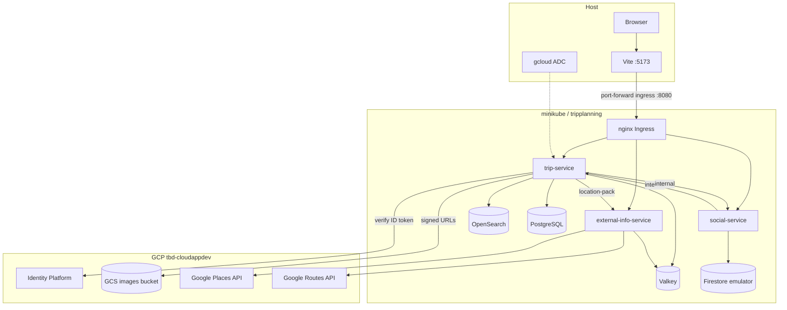
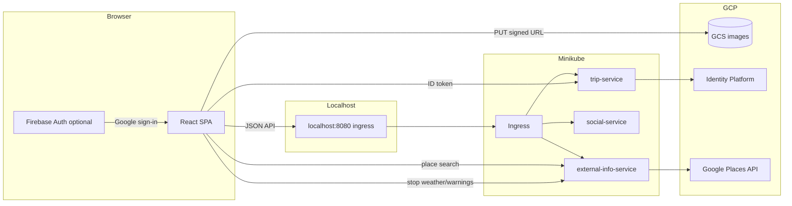
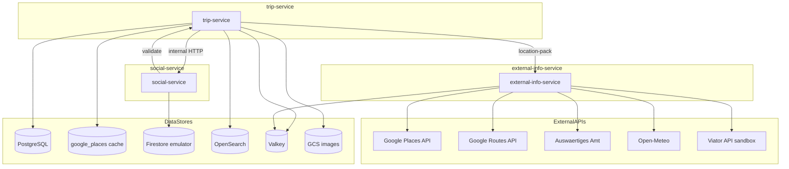
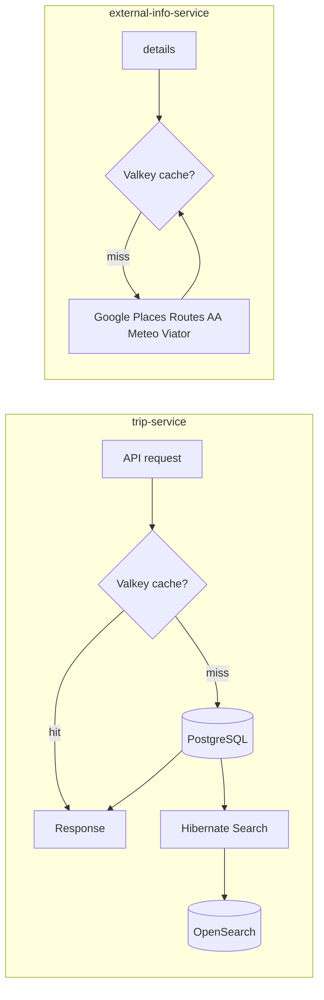

# Local Minikube state — cluster resources & data flows

Reference for the **local ms2-shaped** stack on Minikube: in-cluster components, localhost access, and the small set of GCP services still used (Identity Platform, GCS, Google Places / Routes APIs).

**Scope:** `kubectl` context `minikube`, namespace `tripplanning`. For setup/teardown, see [README.md](README.md). For GKE architecture and inventory, see [ms2 STATE.md](../../../infrastructure/ms2/docs/STATE.md); setup/runbook: [ms2 overview](../../../infrastructure/ms2/docs/overview.md) and [Terraform dev env](../../../infrastructure/ms2/terraform/envs/dev/README.md).

---

## 1. Resource inventory

### Minikube cluster

| Category | Resource | Name / pattern |
|----------|----------|----------------|
| **Cluster** | Minikube | Context `minikube`; default driver `docker` |
| **Namespace** | Kubernetes | `tripplanning` |
| **Images** | Local Docker (minikube daemon) | `tripplanning-{trip,social,external-info,seed-job}-service:local` (seed-job image tag `:local`), `imagePullPolicy: Never` |

### In-cluster (namespace `tripplanning`)

| Component | Implementation | Manifest |
|-----------|----------------|----------|
| **trip-service** | Spring Boot, PostgreSQL + OpenSearch + Valkey | [`k8s/local/chart/templates/deployments/trip-deployment.yaml`](../../k8s/local/chart/templates/deployments/trip-deployment.yaml) |
| **social-service** | Spring Boot, Firestore emulator | [`k8s/local/chart/templates/deployments/social-deployment.yaml`](../../k8s/local/chart/templates/deployments/social-deployment.yaml) |
| **external-info-service** | Spring Boot, Valkey cache | [`k8s/local/chart/templates/deployments/external-info-deployment.yaml`](../../k8s/local/chart/templates/deployments/external-info-deployment.yaml) |
| **PostgreSQL** | Postgres 16, StatefulSet + PVC | [`k8s/local/chart/templates/backing/postgres-*.yaml`](../../k8s/local/chart/templates/backing/) |
| **Valkey** | Official Helm subchart (`valkey-io/valkey-helm`) | [`k8s/local/chart/Chart.yaml`](../../k8s/local/chart/Chart.yaml) |
| **OpenSearch** | Official Helm subchart 2.x (`opensearch-project/helm-charts`), single-node + 5Gi PVC | [`k8s/local/chart/Chart.yaml`](../../k8s/local/chart/Chart.yaml) |
| **Firestore emulator** | `google-cloud-cli:emulators` | [`k8s/local/chart/templates/firestore-emulator.yaml`](../../k8s/local/chart/templates/firestore-emulator.yaml) |
| **valkey-admin** (debug) | Official Valkey Admin web UI | [`k8s/local/chart/templates/debug/valkey-admin-*.yaml`](../../k8s/local/chart/templates/debug/) |
| **opensearch-dashboards** (debug) | Official OpenSearch Dashboards (Dev Tools, Discover) | [`k8s/local/chart/Chart.yaml`](../../k8s/local/chart/Chart.yaml) subchart |

Installed by [`scripts/local-dev.sh`](../../scripts/local-dev.sh) → `helm upgrade` from [`k8s/local/chart`](../../k8s/local/chart/) (Postgres, Valkey, OpenSearch subcharts, apps, Firestore emulator, optional debug UIs).

**Postgres:** enabled in [`values-local.yaml`](../../k8s/local/chart/values-local.yaml) (`backingServices.postgres.enabled: true`). Trip-service uses profile **`local,k8s,postgres`** with Flyway migrations. **H2** is only for **JVM-only** dev (`SPRING_PROFILES_ACTIVE=local` without `postgres`).

### Host-only

| Component | Role |
|-----------|------|
| **Vite frontend** | `http://localhost:5173` → API via port-forward |
| **nginx Ingress** | Path-based API gateway (`tripplanning-api` in `tripplanning`) |
| **kubectl port-forward** | Default: ingress → `localhost:8080` (all API paths) |
| **gcloud ADC** | Identity token verification, GCS signed URLs (not in-cluster) |

### GCP (used, not provisioned by local scripts)

| Service | Used by | Local behavior |
|---------|---------|----------------|
| **Identity Platform / Firebase** | trip-service (`POST /api/v2/auth/firebase`) | Real project; optional if using dev-login only |
| **GCS images bucket** | trip-service signed uploads | Real bucket via ADC + SA impersonation in `application-local.yml` |
| **Google Places API (New)** | external-info-service | Place search and details via `GOOGLE_MAPS_API_KEY` |
| **Google Routes API** | external-info-service | Transport route (distance, duration, polyline per mode) |
| **Maps JavaScript API** | frontend (`VITE_GOOGLE_MAPS_API_KEY`) | Draw transport route polylines on trip detail (browser key, referrer-restricted) |

### Not used locally

Terraform, GKE, Cloud SQL, Cloud Firestore `tbd-firestore`, Artifact Registry, Gateway API, Cloud DNS, cert-manager, frontend GCS bucket deploy.

---

## 2. High-level topology



---

## 3. Local hostnames & routing

| URL (after `./scripts/local-dev.sh port-forward`) | Serves |
|---------------------------------------------------|--------|
| `http://localhost:8080` | **nginx Ingress** — single API entry (same paths as GKE Gateway) |

Optional direct pod/service port-forwards (`:8081`, `:8082`) are for debugging only.

The SPA uses **one** base URL (`VITE_API_BASE_URL=http://localhost:8080` or Vite proxy to the same). **Ingress** routes by path prefix (see [`k8s/local/chart/values-local.yaml`](../../k8s/local/chart/values-local.yaml) `ingressRoutes`):

| Path prefix | Backend |
|-------------|---------|
| `/api/v2/comments`, `/api/v2/trips/.../community`, likes, `countLikes` | social-service |
| `/api/v2/external` | external-info-service |
| `/internal/debug` | trip-service (search-index / Valkey debug) |
| `/debug/valkey/` | Valkey Admin (use trailing slash; ingress redirects bare `/debug/valkey`) |
| `/debug/opensearch` | OpenSearch Dashboards |
| `/api/search`, `/api/v2` (catch-all), `/actuator`, auth | trip-service |
| `/swagger-ui`, `/v3` | trip-service (OpenAPI / Swagger UI) |

With `ingressDebugRoutes: true` (default in `values-local.yaml`), separate ingress resources also expose `/debug/valkey`, `/debug/opensearch`, and `/debug/external`.

---

## 4. Frontend data flow



**Behaviors:**

- Single API entry: `VITE_API_BASE_URL=http://localhost:8080` (or Vite proxy to the same).
- **dev-login** on trip-service avoids Firebase for local testing.
- Place search: `GET /api/v2/external/details/search` via ingress.
- Stop weather/warnings: `GET /api/v2/external/stop-details` (not deprecated `/external/details`).
- Image uploads: signed URL from trip-service; browser PUT to GCS (requires ADC on dev machine).

---

## 5. Backend microservices & data stores

| Service | Container port | K8s Service port | Role |
|---------|----------------|------------------|------|
| trip-service | 8080 | 8080 | Trips, users, Google Places stops, auth, search, liked-trips feed |
| social-service | 8081 | 8081 | Likes & comments (Firestore emulator) |
| external-info-service | 8082 | 8082 | Google Places search, weather, warnings, Viator tours, transport distance (`/api/v2/external`) |



### Per-service data store usage

| Service | SQL | OpenSearch | Valkey | Firestore | GCS | Other HTTP |
|---------|:---:|:-------------:|:-----:|:---------:|:---:|------------|
| **trip-service** | PostgreSQL + `google_places` (JPA, Flyway V1–V14) | Hibernate Search `tripentity-local` | Cache 10s TTL; search-index lock/status | — | Signed uploads | social, external-info (`/internal/location-pack`) |
| **social-service** | — | — | Cache 30s TTL (likes/comments reads) | Emulator `(default)` | — | trip-service |
| **external-info-service** | — | — | Reactive Valkey cache (places 7d, weather/warnings/tours/transport 1d) | — | — | Google Places + Routes, AA, Open-Meteo, Viator; `/internal/**` uses `X-Internal-Secret` |

**In-cluster DNS:**

- `postgres.tripplanning.svc.cluster.local:5432`
- `opensearch.tripplanning.svc.cluster.local:9200`
- `valkey.tripplanning.svc.cluster.local:6379`
- `firestore-emulator.tripplanning.svc.cluster.local:8080`
- `trip-service.tripplanning.svc.cluster.local:8080`
- `social-service.tripplanning.svc.cluster.local:8081`
- `external-info-service.tripplanning.svc.cluster.local:8082`

**Inter-service HTTP only** — no message broker. `X-Internal-Secret` on `/internal/**` when `TRIPPLANNING_INTERNAL_SECRET` is set (trip ↔ social, trip ↔ external-info).

**trip → external-info:** `GET /internal/location-pack?placeId=&fresh=` with `X-Internal-Secret`; used on write paths to resolve and cache Google place metadata.

---

## 6. Valkey & OpenSearch



| System | Used by | Purpose |
|--------|---------|---------|
| **OpenSearch** | trip-service (`local,k8s` profile) | Index `tripentity-local`; official Helm subchart, single-node 2.x + 5Gi PVC; `HIBERNATE_SEARCH_BACKEND_VERSION=opensearch:2.19` |
| **Valkey** | trip-service, social-service, external-info-service | Trip feed cache; social read cache (30s); external-info reactive cache; **SearchIndexCoordinationService** lock/status (`tripplanning:search:index:*`); no cache if Valkey host unset (JVM-only dev) |

**SearchIndexCoordinationService** (trip-service): on cold start, coordinates Hibernate Search mass indexing across pods via a Valkey lock (`tripplanning:search:index:lock`). Readiness includes `searchIndex` health — pods may stay **Not Ready** for 1–3+ minutes until indexing completes. Debug: `GET /internal/debug/search-index` via ingress.

**trip-service Valkey cache names** (10s TTL): `tripFeedPage`, `tripFeedByUser`, `tripFeedLikedBy`, `tripDetail`, `tripExists`.

**external-info-service Valkey cache namespaces** (via `ReactiveValkeyCache`): `places` (7d TTL), `warnings`, `weather`, `tours`, `transportRoute` (1d TTL each for volatile namespaces). When `SPRING_DATA_REDIS_HOST` is unset (JVM-only dev outside k8s), external-info skips caching and calls upstream APIs directly.

---

## 7. Secrets

| Kubernetes secret | Source | Keys |
|-------------------|--------|------|
| `trip-service-secrets` | `docs/gettingstarted/.env` | `TRIPPLANNING_AUTH_JWT_SECRET`, `TRIPPLANNING_INTERNAL_SECRET` |
| `social-service-secrets` | same | `TRIPPLANNING_AUTH_JWT_SECRET`, `TRIPPLANNING_INTERNAL_SECRET` |
| `external-info-service-secrets` | same | `TRIPPLANNING_AUTH_JWT_SECRET`, `TRIPPLANNING_INTERNAL_SECRET`, `GOOGLE_MAPS_API_KEY`, `VIATOR_API_KEY` |

No Secret Manager or External Secrets on the local path. ConfigMaps are applied imperatively by `local-dev.sh` (Firestore host, OpenSearch/Valkey, CORS, service URLs).

---

## 8. Naming quick reference

```
kubectl context:  minikube
namespace:        tripplanning
image tag:        local
trip-service:     tripplanning-trip-service:local
social-service:   tripplanning-social-service:local
external-info:    tripplanning-external-info-service:local
seed-job:         tripplanning-seed-job:local
postgres:         postgres:5432 (db tripplanning)
firestore:        firestore-emulator:8080
GCP project:      tbd-cloudappdev (auth + GCS + Places API; local dev)
localhost API:    http://localhost:8080 (ingress port-forward)
frontend dev:     http://localhost:5173
```

---

## 9. Repository layout (backend root)

| Path | Purpose |
|------|---------|
| `pom.xml` | Maven parent; modules: `tripplanning-common`, `tripplanning-trip-service`, `tripplanning-social-service`, `tripplanning-external-info-service`, `tripplanning-seed-job` |
| `tripplanning-*/` | Service source and `src/main/resources/application-*.yml` |
| `k8s/local/chart/` | Helm chart for Minikube (see [`k8s/local/README.md`](../../k8s/local/README.md)) |
| `scripts/local-dev.sh` | Build images, apply manifests, port-forward, verify, seed-job |
| `docs/gettingstarted/` | This guide, `.env.example`, [STATE.md](STATE.md) |
| `temp/db/`, `temp/search/` | **Host JVM-only** H2 + Lucene when running trip-service with `local` profile outside k8s (runtime files gitignored; `.gitkeep` only tracked) |

Minikube trip-service stores SQL data in the **postgres StatefulSet PVC**. Host `temp/` is not used for the default Minikube deploy.

---

## 10. Local vs GKE (quick reference)

Full GKE inventory: [infrastructure/ms2/docs/STATE.md](../../../infrastructure/ms2/docs/STATE.md).

| Aspect | Local (this doc) | GKE dev (`tripplanning-free`) |
|--------|------------------|-------------------------------|
| **Namespace** | `tripplanning` | `tripplanning-free` |
| **Deploy** | `./scripts/local-dev.sh` + Helm local chart | Terraform + Flux + ms2 Helm chart |
| **API entry** | nginx Ingress → `localhost:8080` port-forward | `https://k8s.tbd-htwg.de/api/*` (frontend LB → api-router) + `https://api.k8s.tbd-htwg.de` (Gateway) |
| **api-router** | No — Ingress routes directly | Yes — nginx splits trip/user social paths |
| **Firestore** | In-cluster emulator | Managed `tbd-firestore` |
| **Postgres** | In-cluster Postgres 16 | In-cluster Postgres 15 |
| **Search DNS** | `opensearch:9200`, index `tripentity-local` | `elasticsearch:9200`, index `tripentity` |
| **Secrets** | `docs/gettingstarted/.env` → K8s secrets | GCP Secret Manager → External Secrets |
| **Images** | `tripplanning-*-service:local` | `ghcr.io/tbd-htwg/backend/...:latest` |

---

## 11. Key source files

| Topic | Path |
|-------|------|
| Lifecycle automation | [`scripts/local-dev.sh`](../../scripts/local-dev.sh), [README.md](README.md) |
| Verify smoke tests | [`scripts/verify-local-deployment.sh`](../../scripts/verify-local-deployment.sh) |
| Local K8s manifests | [`k8s/local/chart/`](../../k8s/local/chart/) (Helm templates; rendered by `local-dev.sh`) |
| Valkey / OpenSearch (Helm subcharts) / Postgres (local chart) | [`k8s/local/chart/`](../../k8s/local/chart/) |
| Places & external-info API | `tripplanning-external-info-service/.../ExternalPublicApiController.java`, `InternalExternalApiController.java`, `ExternalDetailsService.java` |
| Place cache (trip-service) | `tripplanning-trip-service/.../place/PlaceService.java` |
| Search index coordination | `tripplanning-trip-service/.../search/SearchIndexCoordinationService.java` |
| Perf seed job | [`tripplanning-seed-job/README.md`](../../tripplanning-seed-job/README.md) |
| Flyway (Postgres) | `tripplanning-trip-service/src/main/resources/db/migration/V10__*.sql` … `V14__*.sql` |
| Spring local + k8s profiles | `tripplanning-*/src/main/resources/application-local.yml`, `application-k8s.yml`, `application-postgres.yml` |
| GKE counterpart | [ms2 STATE.md](../../../infrastructure/ms2/docs/STATE.md) · [overview](../../../infrastructure/ms2/docs/overview.md) |
| Frontend API client | [`frontend/src/api/client.ts`](../../../frontend/src/api/client.ts) |
