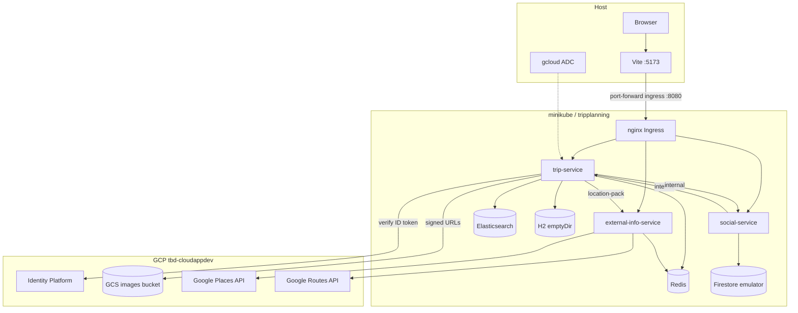
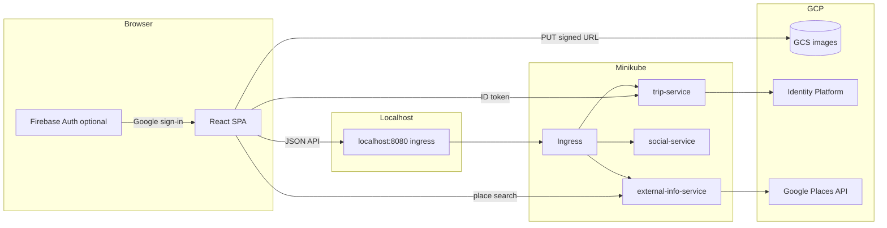
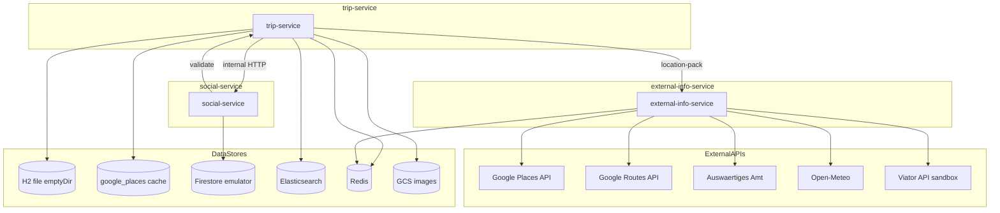
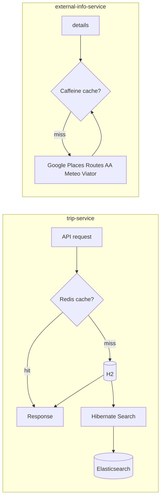

# Local Minikube state — cluster resources & data flows

Reference for the **local ms2-shaped** stack on Minikube: in-cluster components, localhost access, and the small set of GCP services still used (Identity Platform, GCS, Google Places / Routes APIs).

**Scope:** `kubectl` context `minikube`, namespace `tripplanning`. For setup/teardown, see [README.md](README.md). For GKE / Terraform inventory, see [ms2 STATE.md](../../../infrastructure/ms2/docs/gettingstarted/STATE.md).

---

## 1. Resource inventory

### Minikube cluster

| Category | Resource | Name / pattern |
|----------|----------|----------------|
| **Cluster** | Minikube | Context `minikube`; default driver `docker` |
| **Namespace** | Kubernetes | `tripplanning` |
| **Images** | Local Docker (minikube daemon) | `tripplanning-{trip,social,external-info}-service:local`, `imagePullPolicy: Never` |

### In-cluster (namespace `tripplanning`)

| Component | Implementation | Manifest |
|-----------|----------------|----------|
| **trip-service** | Spring Boot, H2 + ES + Redis | [`k8s/local/chart/templates/deployments/trip-deployment.yaml`](../../k8s/local/chart/templates/deployments/trip-deployment.yaml) |
| **social-service** | Spring Boot, Firestore emulator | [`k8s/local/chart/templates/deployments/social-deployment.yaml`](../../k8s/local/chart/templates/deployments/social-deployment.yaml) |
| **external-info-service** | Spring Boot, Redis + Caffeine cache | [`k8s/local/chart/templates/deployments/external-info-deployment.yaml`](../../k8s/local/chart/templates/deployments/external-info-deployment.yaml) |
| **Redis** | `redis:7-alpine` | [`k8s/local/chart/templates/backing/redis-*.yaml`](../../k8s/local/chart/templates/backing/) |
| **Elasticsearch** | Elastic 7.17.x, StatefulSet + 5Gi PVC | [`k8s/local/chart/templates/backing/elasticsearch-*.yaml`](../../k8s/local/chart/templates/backing/) |
| **Firestore emulator** | `google-cloud-cli:emulators` | [`k8s/local/chart/templates/firestore-emulator.yaml`](../../k8s/local/chart/templates/firestore-emulator.yaml) |
| **redis-commander** (debug) | Web UI for Redis | [`k8s/local/chart/templates/debug/redis-commander-*.yaml`](../../k8s/local/chart/templates/debug/) |

Installed by [`scripts/local-dev.sh`](../../scripts/local-dev.sh) → `helm template` + `kubectl apply` from [`k8s/local/chart`](../../k8s/local/chart/) (Redis, Elasticsearch, apps, Firestore emulator, optional debug UIs).

**Postgres:** chart includes a StatefulSet template (`backingServices.postgres`) but it is **`enabled: false`** in local values — trip-service uses **H2 in-pod**, not Postgres.

### Host-only

| Component | Role |
|-----------|------|
| **Vite frontend** | `http://localhost:5173` → API via port-forward |
| **nginx Ingress** | Path-based API gateway (`tripplanning-api` in `tripplanning`) |
| **kubectl port-forward** | Default: ingress → `localhost:8080` (all API paths) |
| **gcloud ADC** | Identity token verification, GCS signed URLs (not in-cluster) |

### GCP (used, not provisioned by local scripts)

| Service | Used by | Local behavior |
|---------|---------|----------------|
| **Identity Platform / Firebase** | trip-service (`POST /api/v2/auth/google`) | Real project; optional if using dev-login only |
| **GCS images bucket** | trip-service signed uploads | Real bucket via ADC + SA impersonation in `application-local.yml` |
| **Google Places API (New)** | external-info-service | Place search and details via `GOOGLE_MAPS_API_KEY` |
| **Google Routes API** | external-info-service | Transport distance/duration |

### Not used locally

Terraform, GKE, Cloud SQL, Cloud Firestore `tbd-firestore`, Artifact Registry, Gateway API, Cloud DNS, cert-manager, frontend GCS bucket deploy.

---

## 2. High-level topology



---

## 3. Local hostnames & routing

| URL (after `./scripts/local-dev.sh port-forward`) | Serves |
|---------------------------------------------------|--------|
| `http://localhost:8080` | **nginx Ingress** — single API entry (same paths as GKE Gateway) |

Optional direct pod/service port-forwards (`:8081`, `:8082`) are for debugging only.

The SPA uses **one** base URL (`VITE_API_BASE_URL=http://localhost:8080` or Vite proxy to the same). **Ingress** routes by path prefix (see [`k8s/local/chart/templates/ingress-nginx.yaml`](../../k8s/local/chart/templates/ingress-nginx.yaml)):

| Path prefix | Backend |
|-------------|---------|
| `/api/v2/comments`, `/api/v2/trips/.../community`, likes, `countLikes` | social-service |
| `/api/v2/external` | external-info-service |
| `/internal/debug` | trip-service (search-index / Redis debug) |
| `/debug/redis` | redis-commander |
| `/api/search`, `/api/v2` (catch-all), `/actuator`, auth | trip-service |

With `ingressDebugRoutes: true` (default in `values-local.yaml`), separate ingress resources also expose `/debug/elasticsearch` and `/debug/external`.

---

## 4. Frontend data flow



**Behaviors:**

- Single API entry: `VITE_API_BASE_URL=http://localhost:8080`.
- **dev-login** on trip-service avoids Firebase for local testing.
- Image uploads: signed URL from trip-service; browser PUT to GCS (requires ADC on dev machine).

---

## 5. Backend microservices & data stores

| Service | Container port | K8s Service port | Role |
|---------|----------------|------------------|------|
| trip-service | 8080 | 8080 | Trips, users, Google Places stops, auth, search, liked-trips feed |
| social-service | 8081 | 8081 | Likes & comments (Firestore emulator) |
| external-info-service | 8082 | 8082 | Google Places search, weather, warnings, Viator tours, transport distance (`/api/v2/external`) |



### Per-service data store usage

| Service | SQL | Elasticsearch | Redis | Firestore | GCS | Other HTTP |
|---------|:---:|:-------------:|:-----:|:---------:|:---:|------------|
| **trip-service** | H2 + `google_places` (JPA, no Flyway locally) | Hibernate Search `tripentity-local` | Cache 10s TTL; search-index lock/status | — | Signed uploads | social, external-info (`/internal/location-pack`) |
| **social-service** | — | — | — | Emulator `(default)` | — | trip-service |
| **external-info-service** | — | — | Present in cluster; reactive `@Cacheable` uses **Caffeine** | — | — | Google Places + Routes, AA, Open-Meteo, Viator; JWT on public routes |

**In-cluster DNS:**

- `elasticsearch.tripplanning.svc.cluster.local:9200`
- `redis.tripplanning.svc.cluster.local:6379`
- `firestore-emulator.tripplanning.svc.cluster.local:8080`
- `trip-service.tripplanning.svc.cluster.local:8080`
- `social-service.tripplanning.svc.cluster.local:8081`
- `external-info-service.tripplanning.svc.cluster.local:8082`

**Inter-service HTTP only** — no message broker. `X-Internal-Secret` on `/internal/**` when `TRIPPLANNING_INTERNAL_SECRET` is set (trip ↔ social, trip ↔ external-info).

**trip → external-info:** `GET /internal/location-pack?placeId=&fresh=` with `X-Internal-Secret`; used on write paths to resolve and cache Google place metadata.

---

## 6. Redis & Elasticsearch



| System | Used by | Purpose |
|--------|---------|---------|
| **Elasticsearch** | trip-service (`local,k8s` profile) | Index `tripentity-local`; in-chart StatefulSet 7.17.x + 5Gi PVC |
| **Redis** | trip-service, external-info-service | Trip feed cache; **SearchIndexCoordinationService** lock/status (`tripplanning:search:index:*`); Caffeine fallback if Redis host unset (JVM-only) |

**SearchIndexCoordinationService** (trip-service): on cold start, coordinates Hibernate Search mass indexing across pods via a Redis lock (`tripplanning:search:index:lock`). Readiness includes `searchIndex` health — pods may stay **Not Ready** for 1–3+ minutes until indexing completes. Debug: `GET /internal/debug/search-index` via ingress.

**trip-service Redis cache names** (10s TTL): `tripFeedPage`, `tripFeedByUser`, `tripFeedLikedBy`, `tripDetail`, `tripExists`.

**external-info-service Caffeine cache names** (reactive `@Cacheable`): `places` (7d), `warnings`, `weather`, `tours`, `transportDistance` (60m TTL where configured).

---

## 7. Secrets

| Kubernetes secret | Source | Keys |
|-------------------|--------|------|
| `trip-service-secrets` | `docs/gettingstarted/.env` | `TRIPPLANNING_AUTH_JWT_SECRET`, `TRIPPLANNING_INTERNAL_SECRET` |
| `social-service-secrets` | same | `TRIPPLANNING_AUTH_JWT_SECRET`, `TRIPPLANNING_INTERNAL_SECRET` |
| `external-info-service-secrets` | same | `TRIPPLANNING_AUTH_JWT_SECRET`, `TRIPPLANNING_INTERNAL_SECRET`, `GOOGLE_MAPS_API_KEY`, `VIATOR_API_KEY` |

No Secret Manager or External Secrets on the local path. ConfigMaps are applied imperatively by `local-dev.sh` (Firestore host, ES/Redis, CORS, service URLs).

---

## 8. Naming quick reference

```
kubectl context:  minikube
namespace:        tripplanning
image tag:        local
trip-service:     tripplanning-trip-service:local
social-service:   tripplanning-social-service:local
external-info:    tripplanning-external-info-service:local
firestore:        firestore-emulator:8080
GCP project:      tbd-cloudappdev (auth + GCS + Places API; local dev)
localhost API:    http://localhost:8080 (ingress port-forward)
frontend dev:     http://localhost:5173
```

---

## 9. Repository layout (backend root)

| Path | Purpose |
|------|---------|
| `pom.xml` | Maven parent; modules: `tripplanning-common`, `tripplanning-trip-service`, `tripplanning-social-service`, `tripplanning-external-info-service` |
| `tripplanning-*/` | Service source and `src/main/resources/application-*.yml` |
| `k8s/local/chart/` | Helm chart for Minikube (see [`k8s/local/README.md`](../../k8s/local/README.md)) |
| `scripts/local-dev.sh` | Build images, apply manifests, port-forward, verify |
| `docs/gettingstarted/` | This guide, `.env.example`, [STATE.md](STATE.md) |
| `temp/db/`, `temp/search/` | **Host JVM-only** H2 + Lucene when running trip-service with `local` profile outside k8s (runtime files gitignored; `.gitkeep` only tracked) |

Minikube trip-service stores H2 and search data in-pod (`emptyDir` at `/app/temp`), not in the host `temp/` directory.

---

## 10. Key source files

| Topic | Path |
|-------|------|
| Lifecycle automation | [`scripts/local-dev.sh`](../../scripts/local-dev.sh), [README.md](README.md) |
| Verify smoke tests | [`scripts/verify-local-deployment.sh`](../../scripts/verify-local-deployment.sh) |
| Local K8s manifests | [`k8s/local/chart/`](../../k8s/local/chart/) (Helm templates; rendered by `local-dev.sh`) |
| Redis / Elasticsearch (local chart) | [`k8s/local/chart/templates/backing/`](../../k8s/local/chart/templates/backing/) |
| Places & external-info API | `tripplanning-external-info-service/.../ExternalPublicApiController.java`, `InternalExternalApiController.java`, `ExternalDetailsService.java` |
| Place cache (trip-service) | `tripplanning-trip-service/.../place/PlaceService.java` |
| Search index coordination | `tripplanning-trip-service/.../search/SearchIndexCoordinationService.java` |
| Flyway (GKE Postgres only) | `tripplanning-trip-service/src/main/resources/db/migration/V10__*.sql` … `V13__*.sql` |
| Spring local + k8s profiles | `tripplanning-*/src/main/resources/application-local.yml`, `application-k8s.yml` |
| GKE counterpart | [ms2 gettingstarted](../../../infrastructure/ms2/docs/gettingstarted/) |
| Frontend API client | [`frontend/src/api/client.ts`](../../../frontend/src/api/client.ts) |
